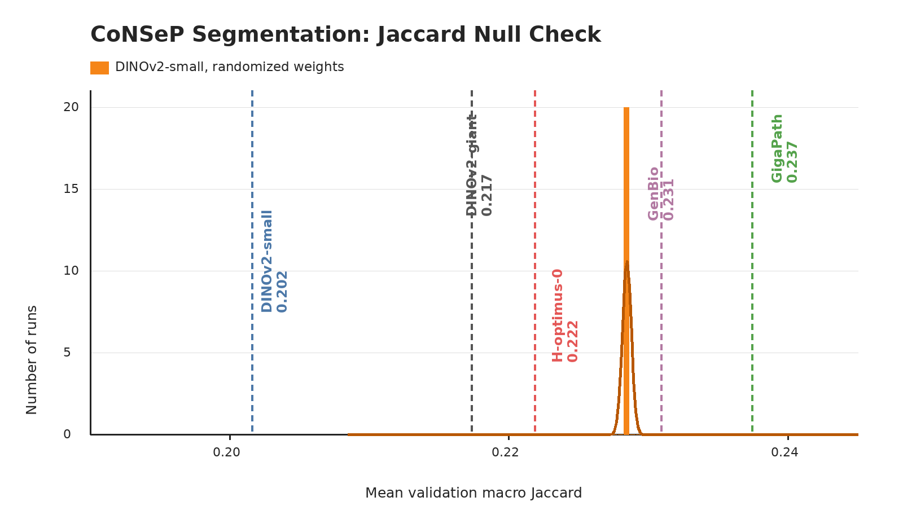

# CoNSeP

## Role In Nanopath

`consep` is a colorectal nucleus segmentation probe. It contributes validation macro Jaccard to the README segmentation column.

## Source

- Dataset: [CoNSeP](https://wrap.warwick.ac.uk/id/eprint/126044/) from HoVer-Net
- Upstream page: `https://warwick.ac.uk/fac/sci/dcs/research/tia/data/hovernet/`
- Portable setup mirror used by `prepare.py`: `medarc/nanopath` under `probes/consep/`

`prepare.py download=True` prints that users must satisfy the official Warwick access terms before using the mirrored files.

## Split

CoNSeP contains 41 H&E colorectal adenocarcinoma image tiles, each 1000x1000 px at 40X, extracted from 16 WSIs with 24,319 annotated nuclei and nuclear phenotype labels. Nanopath uses the official `Train` folder with deterministic 3-fold validation (`SEG_SPLIT_SEED = 1337`).

| split | ROIs |
|---|---:|
| train pool | 27 |
| per-fold train | 18 |
| per-fold val | 9 |

The archive may include `Test`, but `probe.py` does not read it.

## Implementation

`probe.py` loads RGB PNGs and MATLAB `type_map` labels, remaps the original seven HoVer-Net phenotype ids through `CONSEP_REMAP = (0, 1, 2, 3, 3, 4, 4, 4)`, resizes to 256x256, extracts frozen patch tokens once, trains the shared MaskTransformer segmentation head on each fold, and reports the mean validation macro Jaccard. The remap preserves background, other, inflammatory, merged epithelial, and merged spindle/stromal-style classes, giving five labels including background.

## Null Distribution Audit

The orange null uses randomized-weight DINOv2-small evaluations through the same probe path: mean 0.228, std 0.000, max 0.228.

This is a caution flag. The randomized-weight distribution is degenerate, which means CoNSeP's score is strongly influenced by the segmentation head, class priors, or fold construction rather than clean backbone signal. Small changes near 0.228 should not be treated as meaningful representation gains.

## Difference From Original Usage

CoNSeP is often used with its official Train/Test split. Nanopath uses only repeated folds of Train, preserving Test for non-iterative evaluation outside `mean_probe_score`. The MaskTransformer head and per-image macro Jaccard come from THUNDER; CoNSeP is not in THUNDER's standard suite, so this is the THUNDER seg-head applied to a non-THUNDER dataset. This probe is small enough that the decoder and class priors can dominate, so only changes that move the full benchmark mean, or that also improve PanNuke/MoNuSAC, should be considered meaningful.
