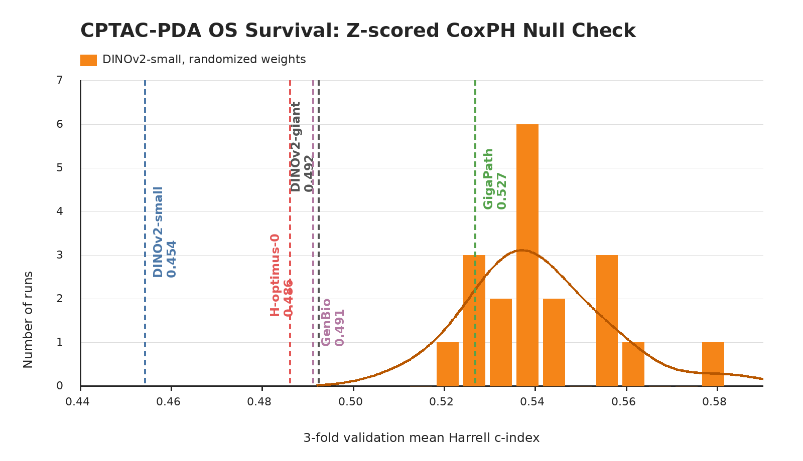

# CPTAC-PDA OS

`cptac_pda_os` is a pancreatic ductal adenocarcinoma case-level overall-survival probe from PathoBench. It contributes 3-fold validation Harrell's c-index as one of the two datasets averaged into the README survival column.

Nanopath's "survival" score reflects the average of LEOPARD BCR and CPTAC-PDA OS. LEOPARD is the easier survival benchmark and CPTAC is intentionally much harder. Despite baselines showing little reliable survival signal beyond the high randomized-DINOv2 null and nuisance controls, we are keeping CPTAC because a hard survival probe is useful for seeing whether new training recipes can hillclimb on a clinically relevant endpoint. Averaging LEOPARD and CPTAC gives the single survival column a sensible balance between an easier signal-bearing task and a harder stress-test task.

## Source

- Dataset: [PathoBench](https://huggingface.co/datasets/MahmoodLab/Patho-Bench) `cptac_pda/OS`
- Labels: `MahmoodLab/Patho-Bench`, file `cptac_pda/OS/k=all.tsv`
- Upstream metadata: `task_type: survival`, `metrics: cindex`, with `OS_event` and `OS_days`
- Slide source: [TCIA CPTAC-PDA](https://www.cancerimagingarchive.net/collection/cptac-pda/) pathology images exposed by [PathDB](https://pathdb.cancerimagingarchive.net/imagesearch?f%5B0%5D=collection%3Acptac-pda)
- Local cluster cache: `/data/CPTAC-PDA`

## Split

Nanopath vendors `cptac_pda_os.json`, derived directly from PathoBench `k=all.tsv`, but does not score PathoBench's official held-out fold. The probe uses only PathoBench fold-0 train: 77 CPTAC-PDA cases, 184 PathDB SVS slide ids, 56 observed events, and 21 censored cases. The 20 fold-0 test cases stay held out as provenance metadata. Deterministic 3-fold event-stratified validation uses seed 1337.

## Probe Implementation

`prepare.py download=True` downloads this prebuilt cache from the `medarc/nanopath` probe mirror. The mirrored cache was generated from public TCIA PathDB SVS files by extracting a deterministic 20x, 512 px, 0-overlap tissue grid with the same lightweight thumbnail tissue mask used by the other PathoBench-derived slide probes, writing one resumable full-grid parquet per slide, then concatenating them into:

- `patches.parquet`: `case_id`, `slide_id`, `tile_idx`, `image`
- `labels.tsv`: `case_id`, `slide_id`, `OS_event`, `OS_days`
- `tiling_version.txt`: `pathobench_20x_512_v1_cptac_pda_os_fold0_train_v1`

The cache contains 131,136 JPEG tiles from the fold-0-train cases.

`probe.py` streams cached tiles with a no-crop square resize, mean-pools tile embeddings by slide, mean-pools slides by case, then fits the same fixed survival head on each train-derived validation fold:

```text
train-fold z-score -> CoxPHSurvivalAnalysis(alpha=2.0)
```

This intentionally differs from PathoBench's default elastic-net Coxnet head. Nanopath compares many custom frozen backbones, so the survival probe uses the same fixed ridge Cox head for every model, preserves all embedding dimensions, standardizes feature scale within each train fold, avoids sparse feature selection, and avoids alpha/l1 sweeps.

## Null Distribution Audit



The orange null uses 20 randomized-weight DINOv2-small evaluations through the same fold-0-train-only probe path. The validation-only null remains high: mean 0.5404, std 0.0148, min 0.5120, max 0.5815.

CPTAC-PDA OS still fails important nuisance checks under the train-derived folds. Non-image controls scored 0.5577 from case order index, 0.6064 from numeric case-id suffix (for example `C3L-00102 -> 102`), 0.5558 from suffix plus C3L/C3N prefix, and 0.5003 from slide count per case. This means CPTAC should be read as a shortcut-sensitive survival probe rather than a clean standalone survival-biology signal.

## Difference From Original Usage

This is PathoBench-derived but not a PathoBench test-fold evaluation. Nanopath uses PathoBench's labels, case ids, and c-index metric, but evaluates only fold-0-train-derived validation on custom-backbone mean-pooled tile features. It uses train-fold z-scored fixed-ridge CoxPH rather than elastic-net Coxnet. The tissue mask is a lightweight deterministic thumbnail mask rather than Trident HEST segmentation, so this should be interpreted as a compact representation probe, not as a claim about the best possible CPTAC-PDA survival model.
