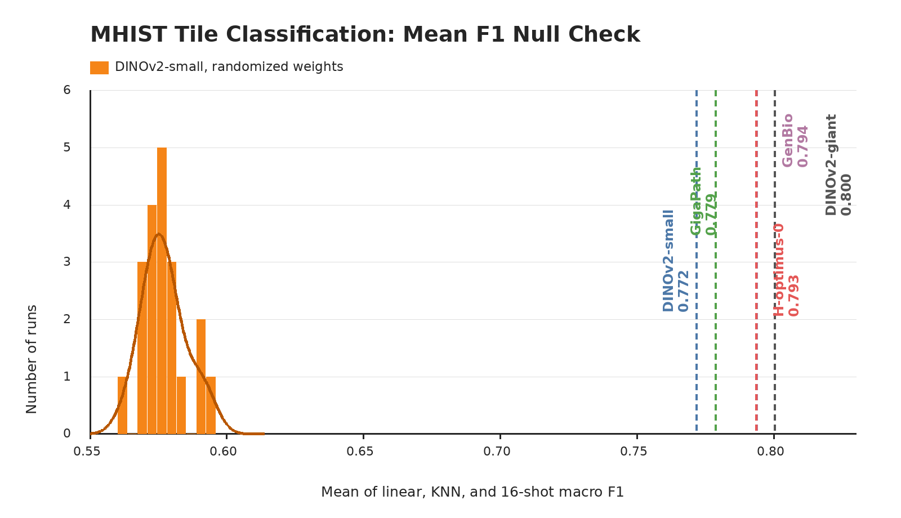

# MHIST

## Role In Nanopath

`mhist` is a colorectal polyp tile-classification probe. It feeds the README linear, KNN, and 16-shot columns with validation macro F1 scores; its per-dataset summary is the mean of those three heads.

## Source

- Dataset: [MHIST](https://bmirds.github.io/MHIST/)
- Benchmark family: [THUNDER](https://mics-lab.github.io/thunder/) tile-classification tasks (`linear_probing`, `knn`, `simple_shot`)
- Upstream access page: `https://bmirds.github.io/MHIST/`
- Portable setup mirror used by `prepare.py`: `medarc/nanopath` under `probes/mhist/`

`prepare.py download=True` prints that users must complete MHIST's Dataset Research Use Agreement before using the mirrored files.

## Split And Labels

MHIST contains 3,152 H&E FFPE colorectal-polyp image patches labeled by majority vote as hyperplastic polyp (HP) or sessile serrated adenoma (SSA). Nanopath uses the checked-in split metadata in `mhist.json`.

| split | images |
|---|---:|
| train | 1743 |
| val | 432 |
| test | 977 |

| label id | class |
|---:|---|
| 0 | HP |
| 1 | SSA |

Only train and val are read by `probe.py`. Train and val are a deterministic split of MHIST's official training partition, which has 1,545 HP and 630 SSA images before splitting. The official test partition has 617 HP and 360 SSA images; it is kept as provenance metadata and is not scored.

## Implementation

The probe embeds MHIST RGB images with Nanopath's default transform or the baseline script's explicit `probe.transform_policy`, then fits three heads on cached embeddings:

- AdamW linear probe: LR ∈ {1e-3, 1e-4, 1e-5}, weight decay 1e-4, batch size 64, 200 epochs; report the best val macro F1 across all LR × epoch checkpoints
- cosine KNN: k ∈ {1, 3, 5, 10, 20, 30, 40, 50}, k selected by val F1
- SimpleShot few-shot: 1000 deterministic 16-shot support sets per class, support/query embeddings centered by each support-set mean, class prototypes from class-specific centered support means, cosine nearest-centroid prediction, then per-query majority vote

The dataset score is `mean(linear_val_f1, knn_val_f1, fewshot_val_f1)`. Macro F1 keeps the minority SSA class visible despite the HP-heavy class balance.

## Null Distribution Audit

The orange null uses randomized-weight DINOv2-small evaluations through the same probe path: mean 0.577, std 0.008, max 0.594.

This is a strong null check. The randomized-weight architecture can extract some low-level MHIST signal, but all pretrained references sit far above the null tail, so the probe remains a useful representation-quality readout.

## Difference From Original Usage

MHIST ships with its own agreement-gated access path and task framing. Nanopath uses a checked-in split of the official training partition for fast frozen-backbone validation and keeps test metadata out of `mean_probe_score`. The task is only binary, but HP-vs-SSA is a real diagnostic distinction rather than a trivial tumor/normal contrast; the null audit shows randomized weights already capture some low-level signal, so small gains should be interpreted with the usual 0.006 benchmark-noise threshold.
