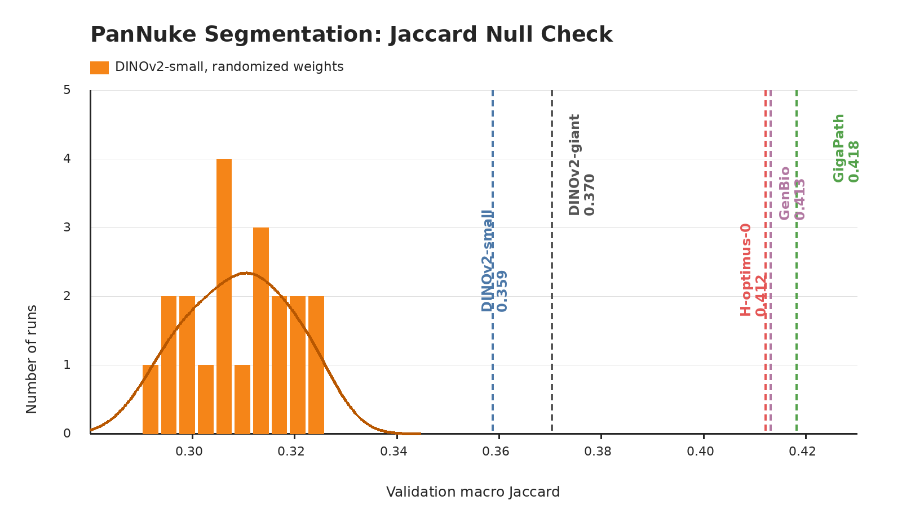

# PanNuke

## Role In Nanopath

`pannuke` is a multi-organ nucleus segmentation probe. It contributes validation macro Jaccard to the README segmentation column.

## Source

- Dataset: [PanNuke](https://arxiv.org/abs/2003.10778)
- Benchmark family: [THUNDER](https://mics-lab.github.io/thunder/) segmentation task
- Upstream source: `https://warwick.ac.uk/fac/cross_fac/tia/data/pannuke/fold_<N>.zip`
- Download used by `prepare.py`: `medarc/nanopath`, under `probes/pannuke/`

## Split

PanNuke is a pan-cancer nuclei segmentation and classification dataset spanning 19 tissue types with about 200k annotated nuclei. The local arrays are 256x256 RGB patches with a 6-channel mask tensor: five foreground nucleus classes plus background. Nanopath uses fixed PanNuke folds:

| split | source fold | images |
|---|---|---:|
| train | Fold1 | 2656 |
| val | Fold2 | 2523 |

Fold3 has 2,722 images in the full release, but it is not downloaded by `prepare.py` and is not part of `mean_probe_score`.

## Implementation

`probe.py` reads `images.npy` and `masks.npy` by memory map, derives integer class labels from the first five mask channels in upstream order (neoplastic, inflammatory, connective, dead, epithelial; background is 0), extracts frozen patch tokens, trains the shared MaskTransformer decoder for 30 epochs, selects by validation dice loss, and reports validation macro Jaccard with the THUNDER-compatible background-only weighting.

## Null Distribution Audit

The orange null uses randomized-weight DINOv2-small evaluations through the same probe path: mean 0.309, std 0.010, max 0.325.

This is a reasonably clean segmentation null check. Randomized weights produce a nontrivial floor, but every pretrained reference clears the null tail and pathology-pretrained models separate further.

## Difference From Original Usage

PanNuke is commonly evaluated with fold-based protocols across all folds. Nanopath fixes Fold1/Fold2 so every training run uses the same fast validation probe and leaves Fold3 out of the leaderboard score. Interpret the scalar as a frozen-feature semantic segmentation readout under a small decoder, not as a full PanNuke instance-segmentation benchmark.
