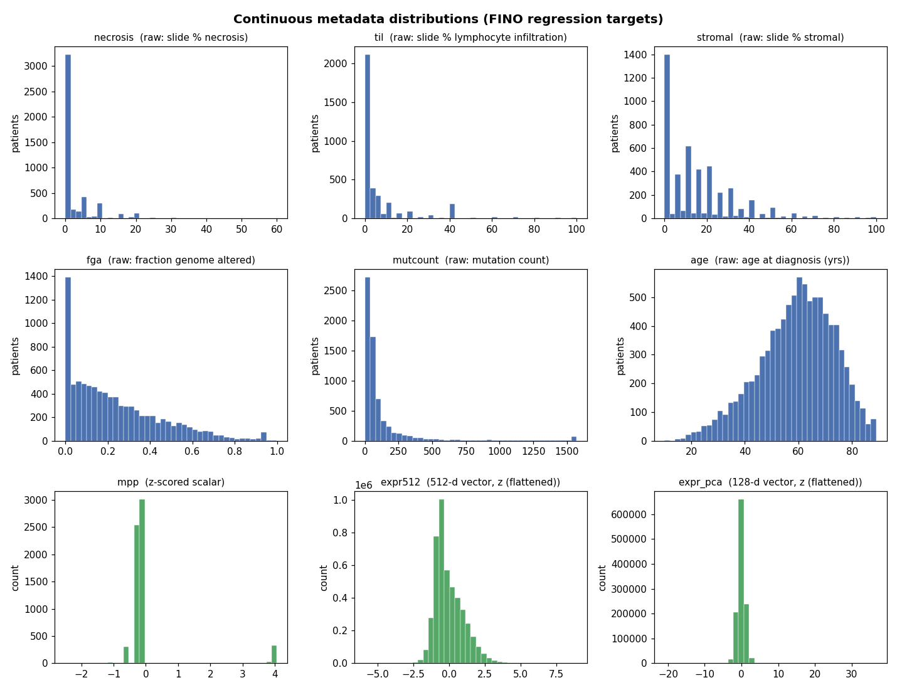
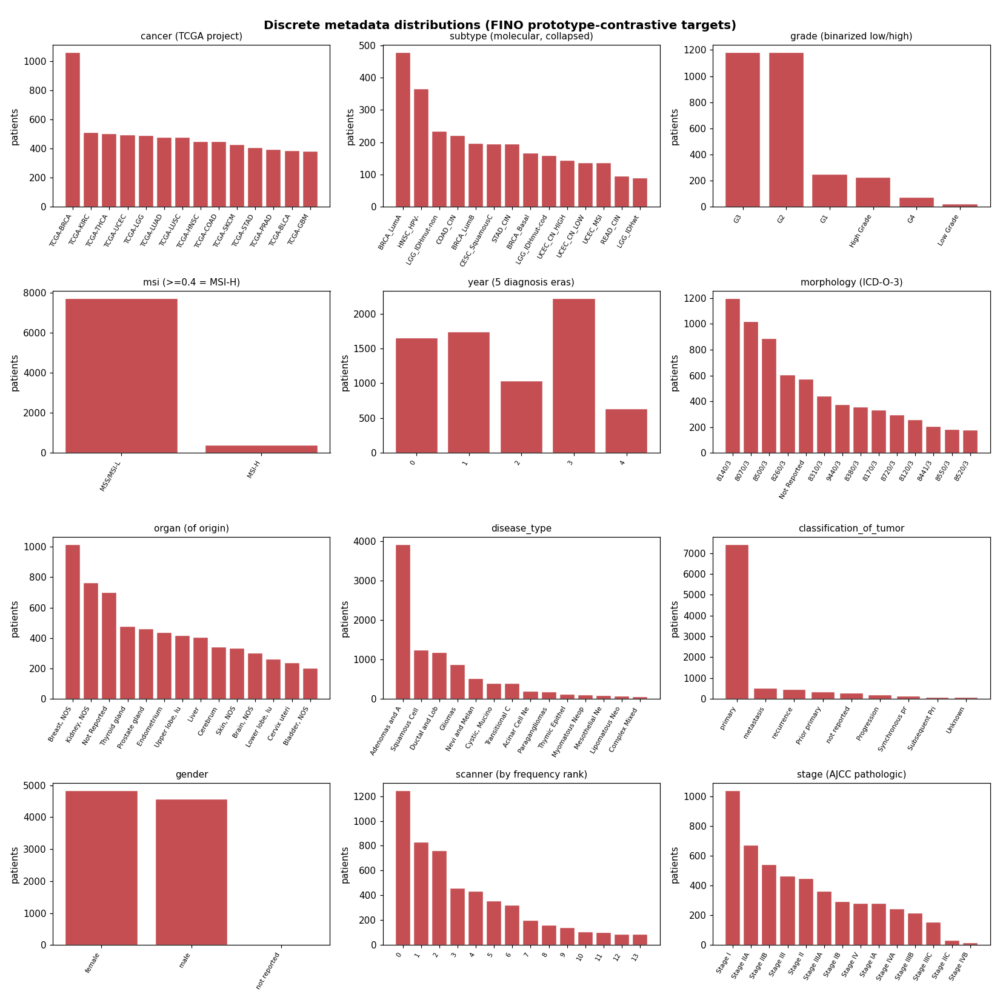

# FINO metadata attributes — definitions, distributions, examples

Every attribute in `fino_meta.json` that was available as a FINO guidance target, with its definition, source,
coverage over the **9,389 TCGA tile-patients**, processing, and an example. Each is selected in a config as
`fino.discrete: [[name, sign]]` or `fino.continuous: [[name, sign]]` — `sign > 0` = **M+** (encourage; embedding
learns to predict it), `sign < 0` = **M−** (suppress; gradient-reversed). Discrete factors use a prototype-
contrastive loss over a dense integer id; continuous factors are z-scored and regressed by an MLP. Patients absent
from a factor's map are masked out of that branch. The validated jepa-fino recipe uses `subtype`, `expr512`, and `fga`.

## Continuous attributes (regression targets)

Raw distributions shown above; all are **log1p-ed where skewed, then z-scored** before use (the zero-inflation in
necrosis/til/stromal and the heavy tail in mutcount are exactly why). Vector factors (`expr*`) z-score each dim.

| attribute | definition | source | dim | cov | example / shape |
|---|---|---|---|---|---|
| `necrosis` | slide % necrosis (GDC pixel readout) | clinical `slide_percent_necrosis` | 1 | 49% | zero-inflated, 0–60% |
| `til` | slide % tumor-infiltrating lymphocytes | clinical `slide_percent_lymphocyte_infiltration` | 1 | 38% | zero-inflated, 0–100% |
| `stromal` | slide % stromal cells | clinical `slide_percent_stromal_cells` | 1 | 49% | right-skewed, 0–100% |
| `fga` | **fraction of genome altered** (CN gains/losses) — genomic instability | genomics `cbio_fraction_genome_altered` | 1 | 94% | 0–1, median 0.19 |
| `mutcount` | somatic mutation count (≈ tumor mutational burden) | genomics `cbio_mutation_count` | 1 | 70% | heavy-tailed, median 50, max 15,981 |
| `age` | age at diagnosis | clinical `age_at_index` | 1 | 99% | bell ~61, range 10–89 |
| `mpp` | microns per pixel (scan resolution) | scanner `mpp` | 1 | 66% | bimodal (two scan resolutions) |
| `expr` | bulk RNA-seq, top-256 within-organ HVGs | FPKM-UQ panel | 256 | 95% | per-dim z |
| `expr512` | bulk RNA-seq, top-512 within-organ HVGs (**best recipe uses this**) | FPKM-UQ panel | 512 | 95% | per-dim z |
| `expr_pca` | bulk RNA-seq, PCA-128 of standardized log-expression | FPKM-UQ panel | 128 | 95% | per-dim z |
| `expr_path` | 256 KEGG/MSigDB pathway-module scores (mean log-expr of member genes) | FPKM-UQ + `pathway_mask` | 256 | 95% | per-dim z |

## Discrete attributes (prototype-contrastive targets)

### Tumor identity / histology
| attribute | definition | source | classes | cov | example |
|---|---|---|---|---|---|
| `cancer` | TCGA study / cancer type | `project_id` | 33 | 100% | TCGA-BRCA, TCGA-KIRC, TCGA-THCA |
| `subtype` | molecular subtype, collapsed to organs with >1 subtype | genomics `cbio_subtype` | 40 | 40% | BRCA_LumA, LGG_IDHmut, COAD_CIN |
| `morphology` | ICD-O-3 morphology code | clinical `morphology` | 155 | 100% | 8140/3 (adenocarcinoma NOS), 8070/3 (SCC), 8500/3 (ductal) |
| `grade` | tumor grade, binarized low (G1/G2) vs high (G3/G4) | clinical `tumor_grade` | 2 | 31% | high-skewed |
| `diseasetype` | GDC disease-type family | clinical `disease_type` | 24 | 100% | Adenomas & Adenocarcinomas, Squamous Cell Neoplasms |
| `classif` | tumor classification | clinical `classification_of_tumor` | 9 | 100% | primary, metastasis, recurrence |
| `organ` | tissue/organ of origin | clinical `tissue_or_organ_of_origin` | 168 | 100% | Breast, Kidney, … |
| `site` | primary site | clinical `primary_site` | 56 | 100% | — |
| `resection` | site of resection or biopsy | clinical `site_of_resection_or_biopsy` | 86 | 100% | — |

### Staging
| attribute | definition | source | classes | cov |
|---|---|---|---|---|
| `stage` | AJCC pathologic stage | clinical `ajcc_pathologic_stage` | 22 | 54% |
| `tstage` | AJCC T (tumor extent) | clinical AJCC T | 27 | 62% |
| `nstage` | AJCC N (nodal) | clinical AJCC N | 17 | 61% |
| `stageedition` | AJCC staging-system edition | clinical | 7 | 50% |

### Genomic / molecular
| attribute | definition | source | classes | cov | example |
|---|---|---|---|---|---|
| `msi` | microsatellite instability, MSI-H if score ≥ 0.4 | genomics `cbio_msi_score` | 2 | 86% | 7,716 MSS / 377 MSI-H |

### Patient / temporal
| attribute | definition | source | classes | cov |
|---|---|---|---|---|
| `gender` | patient sex | clinical `gender` | 3 | 100% |
| `year` | year of diagnosis, binned into 5 equal-count eras | clinical `year_of_diagnosis` | 5 | 77% |
| `priortx` | prior treatment | clinical `prior_treatment` | 4 | 95% |
| `sampletype` | TCGA sample-type code (primary/normal/metastatic…) | barcode | 5 | 100% |
| `section` | slide section | barcode/clinical | 3 | 100% |

### Acquisition / batch (the "spurious" axes — candidates for M− suppression)
| attribute | definition | source | classes | cov |
|---|---|---|---|---|
| `tss` | tissue source site (the submitting institution) | barcode field 2 | 664 | 100% |
| `scanner` | WSI scanner id | scanner `scanner_id` | 58 | 63% |
| `appmag` | scan magnification (20× vs 40×) | scanner `appmag` | 2 | 66% |

## Notes
- **Coverage** = patients with that attribute / 9,389 tile-patients. Low-coverage factors (grade 31%, til 38%,
  subtype 40%) still train fine — absent patients are masked per-branch — but on fewer examples.
- **`expr*` raw matrices are not committed** (multi-GB FPKM-UQ tables); the derived vectors live in
  `fino_meta.json`.
- Figures regenerated from source CSVs + `fino_meta.json`.
